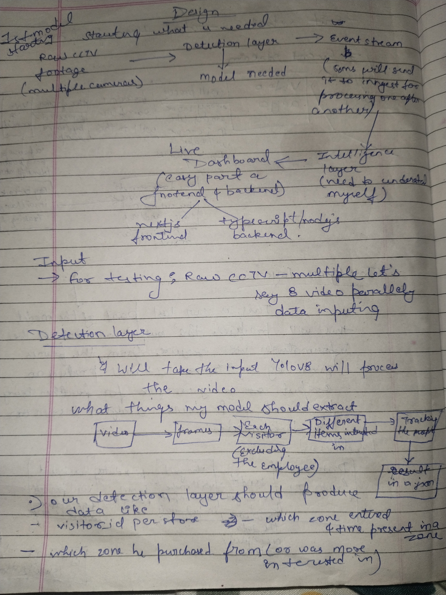
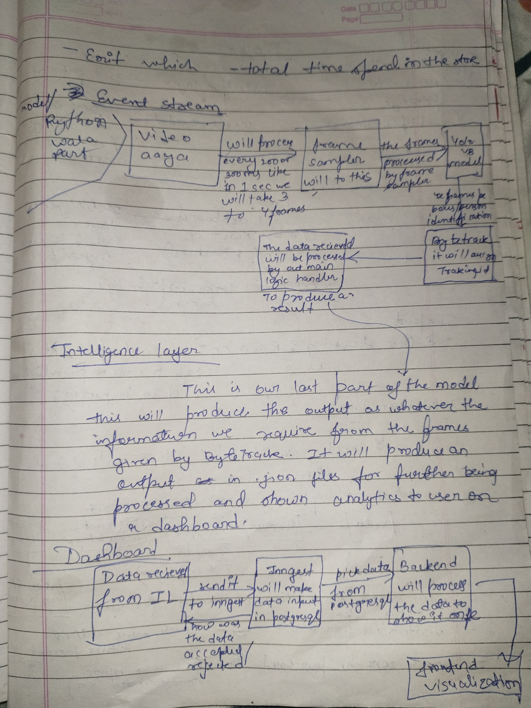
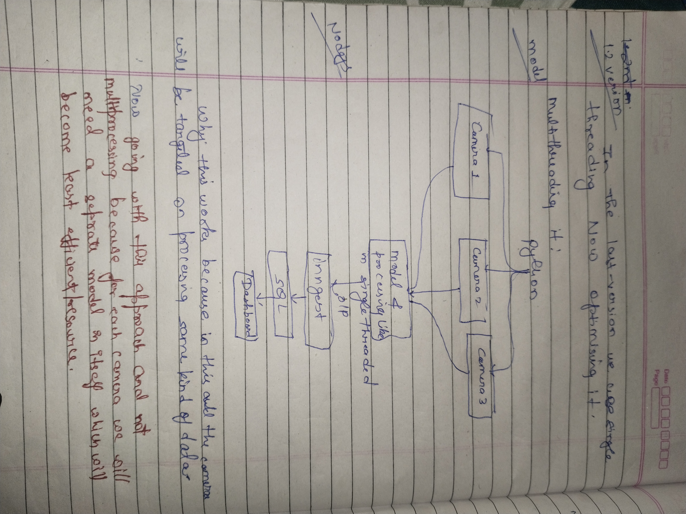

# DESIGN.md — Store Intelligence System
### Apex Retail · Offline Store Analytics Pipeline

---

## 1. System Overview

Starting point is raw CCTV footage from multiple cameras. The system is broken into 4 stages:

```
Raw CCTV Footage (multiple cameras)
            │
            ▼
    ┌─────────────────────┐
    │   Detection Layer   │  YOLOv8 processes video frame by frame
    │   (pipeline/)       │  Extracts each visitor, excludes employees
    └─────────────────────┘
            │
            ▼
    ┌─────────────────────┐
    │   Event Stream      │  Python data part
    │                     │  Sends events to ingest one after another
    └─────────────────────┘
            │
            ▼
    ┌─────────────────────┐
    │  Intelligence Layer │  Takes ByteTrack output
    │   (api/)            │  Produces JSON for further processing
    └─────────────────────┘
            │
            ▼
    ┌─────────────────────┐
    │   Live Dashboard    │  Next.js frontend
    │   (apex_fe/)        │  Shows analytics to user
    └─────────────────────┘
```

---

## 2. Architecture Diagrams

### 2.1 Initial Pipeline Design



*Figure 1 — Initial system design: Raw CCTV footage → Detection Layer → Event Stream → Intelligence Layer → Live Dashboard.*

---

### 2.2 Detection Layer & Event Stream



*Figure 2 — Detection flow: Video → Frames → Each visitor (excluding employees) → Zones identified → ByteTrack → Result JSON. Event stream sends data to ingest one after another.*

---

### 2.3 Threading Model (v1.2)



*Figure 3 — TAR approach: Camera 1/2/3 feed into shared model processing → BIP → Ingest → SQL → Dashboard. Multiprocessing rejected — each camera would need its own model instance which is resource-inefficient.*

---

## 3. Detection Layer

YOLOv8 takes the input and processes the video:

```
Video → Frames → Each Visitor (excluding employees)
      → Different items/zones identified
      → ByteTrack tracking
      → Result in JSON
```

**What the detection layer produces per visitor:**
- `visitor_id` per store
- Which zone they entered + time present in that zone
- Which zone they purchased from (or were most interested in)
- Exit — total time spent in the store

---

## 4. Event Stream

- Python handles the data/video part
- Video analyser runs every second — samples ~15 frames per second
- The data received is processed by the main logic handler
- ByteTrack handles tracking and identity
- Events are sent to ingest **one after another** (sequential, not parallel push)

---

## 5. Intelligence Layer

This is the last part of the model. It:
- Takes the output (frames + tracking data) from ByteTrack
- Produces output as a JSON file
- That JSON is further processed and analytics are shown to the user on the dashboard

---

## 6. Dashboard

```
Data received from Intelligence Layer
  → Ingest (send it to ingest, will make data input in batches)
  → Tangent (picks data from PostgreSQL)
  → Backend (Node.js/TypeScript — processes the data to show once ingest is complete)
  → Frontend visualisation (Next.js)
```

Data accepted/rejected at ingest is tracked and surfaced.

---

## 7. Threading Model (v1.2)

**Previous version (v1.1):** Single-threaded — one thread handled everything sequentially.

**Current version (v1.2):** TAR approach.

```
Python
  ├── Camera 1 ─┐
  ├── Camera 2 ─┼──→ Model & Processing (shared, single-threaded per batch)
  └── Camera 3 ─┘
                      │
                      ▼
                     BIP
                      │
                      ▼
                    Ingest
                      │
                      ▼
                      SQL
                      │
                      ▼
                   Dashboard
```

**Why this works:** Each camera feeds data into the same processing pipeline. The cameras are handled on processing some kind of data concurrently.

**Why multiprocessing was rejected:** For each camera we would need a separate model instance, which becomes least efficient on resources. TAR approach shares the model across all camera feeds.

---

## 8. AI-Assisted Decisions

### 8.1 Threading — TAR vs Multiprocessing

I had already concluded in my design notes that multiprocessing would require a separate model instance per camera making it resource-inefficient. I asked Claude to validate this. It confirmed TAR with a shared model is correct at 15fps on CCTV hardware. **AI confirmed my existing conclusion.**

### 8.2 Session Reconstruction at Query Time

Asked Claude whether to materialise sessions on ingest or reconstruct at query time. It recommended query-time reconstruction for the prototype: simpler ingest path, no state corruption risk on out-of-order events, easier to fix session logic retroactively. Warned it won't scale past ~10M events per store without a materialised view. **Agreed — scale boundary noted in CHOICES.md.**

### 8.3 Staff Detection

Asked Claude whether to use a VLM or a lightweight heuristic for staff detection in the hot path. It recommended against VLM (latency + cost per frame) and suggested HSV histogram + zone pattern classifier. **Agreed** — consistent with the resource-efficiency constraint already driving the threading decision.

---
